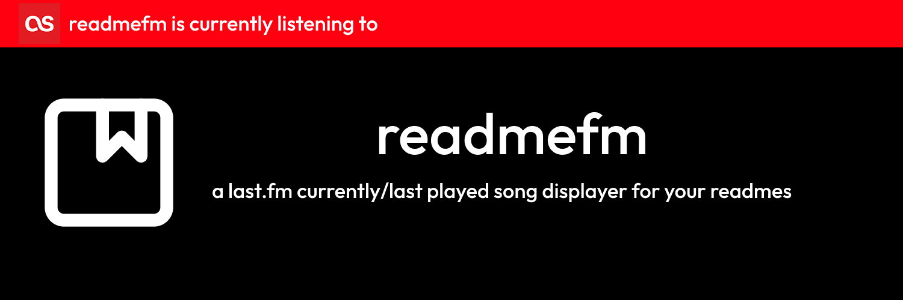

<div align="center">
  
  <br><br>
</div>

[](https://opensource.org/licenses/MIT)
[](https://github.com/BananaJeanss/readmefm/actions/workflows/main.yml)

## Description/Usage

If you don't want to self-host, the setup is pretty simple.

1. Go to [https://readmefm.bnajns.hackclub.app/](https://readmefm.bnajns.hackclub.app/)
2. Enter your Last.fm username (e.g. bananajeans)
3. Customize the options as desired
4. Click "Generate" to get the markdown URL/image link
5. Copy the generated markdown and paste it into your GitHub README.md file

### Example


## Quick Start (self-hosting)

1. Clone the repository: `git clone https://github.com/BananaJeanss/readmefm.git`
2. Navigate to the project directory: `cd readmefm`
3. Install dependencies: `npm install`
4. Create a `.env` file in the root directory and add your Last.fm API credentials:

   ```env
   PORT=3000 (optional, default is 3000)
   LASTFM_API_KEY=your_api_key
   LASTFM_SHARED_SECRET=your_shared_secret
   ```

5. Start the development server: `npm run dev`
6. Access the app at `http://localhost:3000` (or your specified port)

## Contributing

Contributions are welcome! If you have suggestions or improvements, feel free to open an issue or submit a pull request.

## License

This project is licensed under the MIT License. See the [LICENSE](LICENSE) file for details.
